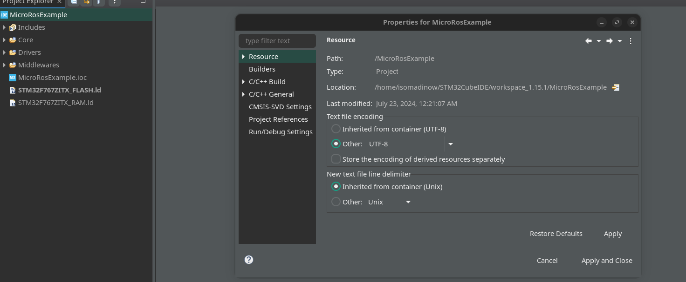

# 1. Настройка со стороны конфигурации cubeIDE:

1. Создаём **новый проект.**
2. В **RCC High Speed Clock (HSE)** ставим в **Crystal/Ceramic Resonator**. (**Low speed Clock (LSE) Не обязательно** включать и ставить в BYPASS Clock Source):


3. Переход в **SYS**, debug ввести в режим **Serial Wire**, затем в **Time base Source** выбрать какой-нибудь **TIM**:


4. **Конфигурация транспорта:**

### 4.1 U(S)ART с прерываниями

Шаги для настройки:

1. Включите U(S)ART в вашем STM32CubeIDE.
2. Для выбранного USART включите глобальное прерывание в настройках NVIC.


### 4.2 U(S)ART с DMA

Шаги для настройки:

1. Включите U(S)ART в вашем STM32CubeIDE.
2. Для выбранного USART включите **DMA для Tx и Rx** в настройках DMA.


3. Установите приоритет DMA на **"Very High"** для Tx и Rx.


4. Установите режим DMA на **"Circular"** для **Rx**. **(Для TX НЕ НАДО)**


5. Для выбранного **USART** включите глобальное прерывание в настройках **NVIC**.


### 4.3 USB CDC

Шаги для настройки:

1. Включите USB в вашем STM32CubeIDE на вкладке **Connectivity**.


2. Выберите режим **Communication Device Class (Virtual Port Com)** в настройках **Middleware -> USB_DEVICE**.


**Примечание: транспорт micro-ROS надо настроить USB_DEVICE/App/usbd_cdc_if.c.**

5. **FreeRTOS**

Убедитесь, что если вы используете FreeRTOS, задача micro-ROS имеет более **10 кБ** стека.


# 2. Скачивание micro-ros библиотек.

1. Клонируйте с гита репозиторий  в папку проекта STM32CubeIDE.

```bash
git clone https://github.com/micro-ROS/micro_ros_stm32cubemx_utils.git
```


2. Перейдите в Project -> Settings -> C/C++ Build -> Settings -> Build Steps Tab и в Pre-build steps добавьте:



```bash
docker pull microros/micro_ros_static_library_builder:foxy && docker run --rm -v ${workspace_loc:/${ProjName}}:/project --env MICROROS_LIBRARY_FOLDER=micro_ros_stm32cubemx_utils/microros_static_library_ide microros/micro_ros_static_library_builder:foxy
```


3. Добавьте директорию включаемых файлов micro-ROS. В Project -> Settings -> C/C++ Build -> Settings -> Tool Settings Tab -> MCU GCC Compiler -> Include paths добавьте 


```bash
../micro_ros_stm32cubemx_utils/microros_static_library_ide/libmicroros/include
```


4. Добавьте предварительно скомпилированную библиотеку micro-ROS. В Project -> Settings -> C/C++ Build -> Settings -> MCU GCC Linker -> Libraries: (Если возникнуть проблемы с докером, во время build **[
Проблема связанное с docker](https://www.notion.so/docker-cd842045d9404e7088a19e28e609aa00?pvs=21)** )


- добавьте `<ABSOLUTE_PATH_TO>/micro_ros_stm32cubemx_utils/microros_static_library_ide/libmicroros` в Library search path (-L)

```bash
../micro_ros_stm32cubemx_utils/microros_static_library_ide/libmicroros
```

- добавьте `microros` в Libraries (-l)


5. Добавьте следующие исходные файлы в ваш проект, перетащив их в папку source:
    - `extra_sources/microros_time.c`
    - `extra_sources/microros_allocators.c`
    - `extra_sources/custom_memory_manager.c`
    - `extra_sources/microros_transports/dma_transport.c` или выбранный вами транспорт.

    
6. Соберите и запустите ваш проект.

### Настройка библиотеки micro-ROS

Вся настройка micro-ROS может быть выполнена в файле colcon.meta перед шагом 3. Подробную информацию о том, как настроить использование статической памяти библиотеки, можно найти в руководстве по настройке Middleware.

### Добавление пользовательских пакетов

Обратите внимание, что папки, добавленные в microros_static_library/library_generation/extra_packages/, и записи, добавленные в microros_static_library/library_generation/extra_packages/extra_packages.repos, будут учитываться этой системой сборки.

# Проблема связанное с docker

### Решение проблемы "permission denied while trying to connect to the Docker daemon socket"

Если при попытке выполнения команд Docker вы получаете ошибку "permission denied while trying to connect to the Docker daemon socket", следуйте этим шагам, чтобы исправить проблему.

### Шаг 1: Добавление пользователя в группу Docker

Добавьте текущего пользователя в группу Docker, чтобы он мог выполнять команды Docker без `sudo`:

1. Откройте терминал.
2. Выполните команду:
    
    ```bash
    sudo usermod -aG docker $USER
    
    ```
    

### Шаг 2: Перезапуск службы Docker

Перезапустите службу Docker, чтобы изменения вступили в силу:

1. Выполните команду:
    
    ```bash
    sudo systemctl restart docker
    
    ```
    

### Шаг 3: Проверка добавления пользователя в группу Docker

Убедитесь, что текущий пользователь действительно добавлен в группу Docker:

1. Выполните команду:
Вы должны увидеть `docker` в списке групп.
    
    ```bash
    groups $USER
    
    ```
    

### Шаг 4: Выход и вход в систему

Выйдите из системы и войдите снова, чтобы изменения вступили в силу.

### Шаг 5: Перезагрузка системы (если необходимо)

Если после выхода и входа в систему проблема сохраняется, перезагрузите систему:

1. Выполните команду:
    
    ```bash
    sudo reboot
    
    ```
    

### Шаг 6: Проверка Docker

После выполнения всех вышеуказанных шагов, проверьте, работает ли Docker без `sudo`:

1. Откройте терминал.
2. Выполните команду:
    
    ```bash
    docker run hello-world
    
    ```